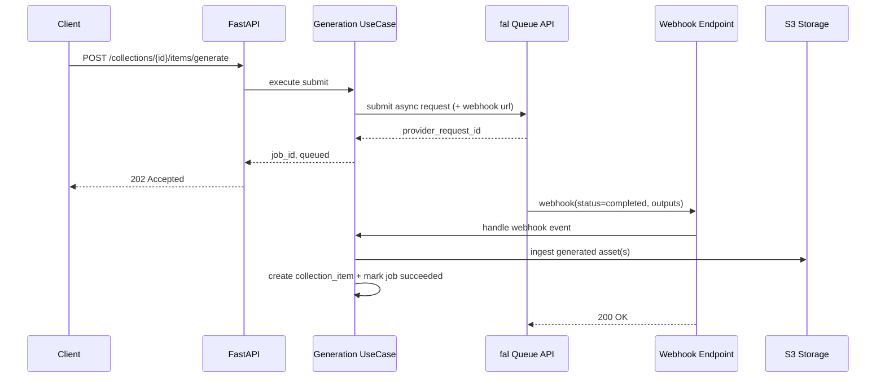

# LLD: Provider-Agnostic Image and Video Generation (fal first, no vendor lock-in)

## 1) Problem statement

The backend currently has a generation endpoint (`POST /collections/{collection_id}/items/generate`) wired to a stub implementation in `CollectionItemSqlRepository.generate_item`.

This couples generation behavior to a repository class and blocks us from:
- Plugging real providers cleanly
- Handling long-running jobs (especially video) reliably
- Switching/fallback between providers
- Keeping our API/provider contract stable over time

## 2) Goals

- Integrate real image and video generation with fal as the first provider.
- Preserve clean architecture boundaries.
- Avoid vendor lock-in at API, domain, and storage levels.
- Support async, long-running generation with status tracking.
- Store final assets in our own object storage and metadata schema.

## 3) Non-goals (phase 1)

- Real-time websocket generation in backend APIs.
- Multi-provider failover in same request path (designed for, enabled later).
- Fine-grained per-user quotas and billing logic.

## 4) Key external constraints (fal)

Based on fal docs:
- Queue API (`https://queue.fal.run`) is the recommended path for longer jobs.
- Synchronous API (`https://fal.run`) exists but is less reliable for long jobs.
- Webhooks are supported by passing `fal_webhook` query param to queue endpoint.
- File inputs for async flows are usually URLs; client helpers exist to upload files.

Implication for this backend:
- Use queue + webhook as default for video and non-trivial image jobs.
- Allow sync fast path only for explicitly configured models and short jobs.

## 5) Proposed architecture

### 5.1 Layer responsibilities

- Presentation (`presentation/api/v1`)
  - Accept generation requests
  - Return job IDs and status payloads
  - Receive provider webhooks
- Application (`application/generation`)
  - Orchestrate submit, webhook handling, polling, and finalize-to-collection-item
- Domain (`domain/generation`)
  - Entities and ports for provider, job repo, and finalization
- Infrastructure (`infrastructure/providers`, `infrastructure/repositories`)
  - fal adapter implementation
  - SQLAlchemy repository for generation jobs

### 5.2 New domain feature: `generation`

Add a new feature folder set:
- `src/ai_video_gen_backend/domain/generation/entities.py`
- `src/ai_video_gen_backend/domain/generation/ports.py`
- `src/ai_video_gen_backend/application/generation/...`
- `src/ai_video_gen_backend/infrastructure/repositories/generation_job_repository.py`
- `src/ai_video_gen_backend/infrastructure/providers/fal/fal_generation_provider.py`

## 6) Canonical domain contracts (vendor neutral)

### 6.1 Entities

- `GenerationJob`
  - `id: UUID`
  - `project_id: UUID`
  - `collection_id: UUID`
  - `media_type: Literal["image", "video"]`
  - `status: Literal["queued", "running", "succeeded", "failed", "cancelled"]`
  - `provider: str` (e.g. `fal`)
  - `model_key: str` (internal key, not provider model id)
  - `request_payload: dict[str, object]` (canonical request)
  - `provider_request_id: str | None`
  - `provider_response: dict[str, object] | None` (raw provider response)
  - `error_code: str | None`
  - `error_message: str | None`
  - `collection_item_id: UUID | None`
  - timestamps (`created_at`, `updated_at`, `submitted_at`, `completed_at`)

- `GenerationRequest`
  - canonical fields, independent of vendor:
  - `prompt`, `negative_prompt`, `aspect_ratio`, `seed`, `duration_seconds`, `fps`, `reference_asset_urls`, `style`, `resolution`
  - optional `provider_overrides: dict[str, object]` for escape hatches

### 6.2 Ports

- `GenerationProviderPort`
  - `submit(request: GenerationRequest, config: ProviderModelConfig) -> ProviderSubmission`
  - `fetch_result(provider_request_id: str) -> ProviderResult`
  - `cancel(provider_request_id: str) -> None`
  - `parse_webhook(payload: dict[str, object], headers: Mapping[str, str]) -> ProviderWebhookEvent`

- `GenerationJobRepositoryPort`
  - CRUD + state transitions (`mark_submitted`, `mark_running`, `mark_succeeded`, `mark_failed`)
  - query pending jobs for poller

- `GeneratedAssetIngestorPort`
  - `ingest_remote_asset(url: str, *, content_type_hint: str | None) -> StoredObject`
  - Reason: final URLs in our DB should point to our storage, not provider CDN

## 7) API design

### 7.1 Submit generation

`POST /api/v1/collections/{collection_id}/items/generate`

Request (canonical):
- Keep current fields where possible.
- Add optional:
  - `idempotencyKey: str`
  - `provider: str | null` (default from config)
  - `model: str | null` (internal model key)
  - `sync: bool = false`

Response:
- `202 Accepted` for async jobs:
  - `{ "jobId": "...", "status": "queued" }`
- Optional `200` for sync fast path when `sync=true` and model allowed.

### 7.2 Get job status

`GET /api/v1/generation-jobs/{job_id}`

Response:
- status and progress info
- if succeeded: include `collectionItemId`
- same error envelope on failures

### 7.3 Provider webhook

`POST /api/v1/provider-webhooks/fal`

Behavior:
- Verify signature/secret/token
- Parse provider payload
- Idempotent processing by `(provider, provider_request_id, event_type, event_time)`
- Transition job state and finalize collection item on success

## 8) Data model and migrations

Add table `generation_jobs` via Alembic:
- `id UUID PK`
- `project_id UUID FK projects(id)`
- `collection_id UUID FK collections(id)`
- `media_type VARCHAR(20)` check in (`image`, `video`)
- `provider VARCHAR(32)`
- `model_key VARCHAR(128)`
- `status VARCHAR(20)` check in (`queued`, `running`, `succeeded`, `failed`, `cancelled`)
- `request_payload JSONB`
- `provider_request_id VARCHAR(255) NULL`
- `provider_response JSONB NULL`
- `error_code VARCHAR(64) NULL`
- `error_message TEXT NULL`
- `collection_item_id UUID NULL FK collection_items(id)`
- `submitted_at TIMESTAMPTZ NULL`
- `completed_at TIMESTAMPTZ NULL`
- `created_at TIMESTAMPTZ default now()`
- `updated_at TIMESTAMPTZ default now()`

Indexes:
- `ix_generation_jobs_project_id`
- `ix_generation_jobs_collection_id`
- `ix_generation_jobs_status`
- `uq_generation_jobs_provider_request_id` (partial unique where not null)
- optional unique on `(collection_id, idempotency_key)` if idempotency key column is added

## 9) Fal adapter design (infrastructure)

### 9.1 Config

Add settings:
- `generation_default_provider` (default `fal`)
- `fal_api_key`
- `fal_default_image_model`
- `fal_default_video_model`
- `fal_webhook_secret` (or shared token)
- `generation_webhook_base_url`
- `generation_poll_interval_seconds`
- `generation_sync_allowed_models` (tuple)

### 9.2 Adapter behavior

- `submit()`:
  - Translate canonical request to fal model input schema
  - Call queue endpoint with webhook URL for async mode
  - Persist `provider_request_id`

- `parse_webhook()`:
  - Validate authenticity
  - Extract request id, status, and output URLs
  - Map provider-specific payload into canonical `ProviderWebhookEvent`

- `fetch_result()`:
  - Used by poller for safety and webhook loss scenarios

### 9.3 Input/output normalization

Keep a per-model mapper module:
- `fal_model_mappers.py`
- maps from canonical request -> model input
- maps provider output -> canonical generated outputs

This is where vendor-specific field names live, never in domain/application/presentation.

## 10) Finalization flow (important for no lock-in)

When provider marks job successful:
- Read provider output URL(s)
- Download asset server-side
- Upload to our S3 bucket (`S3ObjectStorage`)
- Generate video thumbnail (reuse current ffmpeg generator)
- Build normalized metadata
- Create `collection_item`
- Mark generation job as `succeeded` and link `collection_item_id`

Result:
- Product and DB point to our stable object URLs, not provider-hosted URLs.

## 11) End-to-end sequence (async default)

## 12) Error handling and retries

- Submission failure: mark job `failed` with mapped internal error code.
- Webhook handler failure: return non-2xx to force provider retry when supported.
- Finalization partial failures:
  - If upload fails, job remains `failed` and no item is created.
  - If DB fails after upload, delete uploaded object(s) best effort.
- Poller fallback:
  - Periodically re-check `queued/running` jobs older than threshold.

## 13) Vendor lock-in prevention checklist

- Public API uses canonical generation fields only.
- Provider selection is config + domain enum, not hardcoded in route.
- Provider model IDs hidden behind internal `model_key` mapping.
- Provider payloads isolated to infrastructure adapter.
- Persist raw provider response for debugging only.
- Final asset URLs are always from our storage.
- New provider onboarding means adding one adapter + mapper, not changing API contracts.

## 14) Step-by-step implementation plan

Phase 1 (foundation):
- Introduce `generation` domain/application/infrastructure skeleton.
- Add `generation_jobs` migration and repository.
- Refactor current `generate_item` flow to use generation use-cases.

Phase 2 (fal async):
- Implement fal adapter submit + webhook parse.
- Add webhook endpoint and signature/token validation.
- Finalize into `collection_items` + storage ingestion.

Phase 3 (resilience):
- Add poller fallback and retry strategy.
- Add idempotency key support.
- Add observability (structured logs + metrics).

Phase 4 (second provider):
- Add a second adapter behind same port.
- Add provider routing policy (default, weighted, per-model).

## 15) Testing strategy

Unit tests:
- Canonical request validation and mapper translation
- State transitions and retry/idempotency behavior
- Webhook parsing and signature validation

Integration tests:
- Repository transitions and constraints
- Webhook -> item finalization transaction behavior
- Storage cleanup on failure paths

API tests:
- `POST generate` returns 202 + job id
- `GET generation job` status lifecycle
- webhook auth failure and malformed payload errors

## 16) Security and compliance notes

- Keep provider API keys server-side only.
- Validate webhook authenticity before processing.
- Restrict outbound fetch for provider asset URLs with size/time limits.
- Sanitize and cap provider payload logging.

## 17) Suggested folder/file additions

- `src/ai_video_gen_backend/domain/generation/entities.py`
- `src/ai_video_gen_backend/domain/generation/ports.py`
- `src/ai_video_gen_backend/application/generation/submit_generation_job.py`
- `src/ai_video_gen_backend/application/generation/get_generation_job.py`
- `src/ai_video_gen_backend/application/generation/handle_provider_webhook.py`
- `src/ai_video_gen_backend/infrastructure/providers/fal/fal_generation_provider.py`
- `src/ai_video_gen_backend/infrastructure/repositories/generation_job_repository.py`
- `src/ai_video_gen_backend/presentation/api/v1/routers/generation_router.py`
- `src/ai_video_gen_backend/presentation/api/v1/routers/provider_webhook_router.py`
- `alembic/versions/xxxx_generation_jobs.py`

## 18) References

- fal Model Endpoints overview: https://docs.fal.ai/model-apis/model-endpoints
- fal Queue API: https://docs.fal.ai/model-apis/model-endpoints/queue
- fal Webhooks API: https://docs.fal.ai/model-apis/model-endpoints/webhooks
- fal Synchronous requests: https://docs.fal.ai/model-apis/model-endpoints/synchronous-requests
- fal Client uploads: https://docs.fal.ai/model-apis/client
